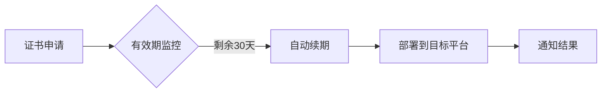

# ALLinSSL - SSL证书全流程管理工具 🔒


<p align="center">
  
</p>

> 🚀 一站式SSL证书生命周期管理解决方案 | 支持Let's Encrypt | 多平台部署 | 自动化运维

## 📌 项目亮点
- ✅ 全自动证书申请/续期
- 🌐 多平台部署（CDN/面板/云存储）
- 🔔 证书过期监控
- 🛡️ 安全入口保护
- 📊 可视化证书管理

## 🚀 快速开始

### 系统要求
- Linux 系统

### 极速安装
```bash
curl -sSO http://download.allinssl.com/install_allinssl.sh && bash install_allinssl.sh allinssl
```

### Docker安装
```bash 
docker run -d --name allinssl -p 7979:8888 -v /www/allinssl/data:/www/allinssl/data allinssl/allinssl:latest
```

### 编译安装
  - 编译安装时需要注意可执行文件的名称和运行目录，在`allinssl.sh`中需要修改为对应的名称和路径否则可能导致脚本不可用
  - 推荐安装路径为`/www/allinssl/`，可执行文件名为`allinssl`，建议将`allinssl.sh`软链到`/usr/bin/`目录下
  - 安装：
    1. 下载最新版本的release包并解压
    2. 编译go程序（allinssl）
    3. 运行可执行文件启动服务
       - Linux: 执行 `./allinssl start`

### 首次配置
1. 访问 `http://your-server-ip:port/安全入口`
2. 添加DNS提供商和主机提供商凭证 ☁️
3. 创建工作流

[完整安装文档](https://allinssl.com/guide/getting-started.html)

## 🎯 核心功能

### 📜 证书管理


| 功能         | 支持提供商                          |
|--------------|-----------------------------------|
| DNS验证      | 阿里云、腾讯云、Cloudflare...      |
| 证书部署     | 宝塔面板、1Panel、阿里云CDN、腾讯云COS |
| 监控通知     | 邮件、Webhook、钉钉                |

### ⚙️ 自动化流程


## 🛠️ 技术架构
- **后端**：Go语言  
- **前端**：HTML/CSS/JavaScript  
- **数据存储**：SQLite  
- **证书管理**：ACME协议 (Let's Encrypt)  
- **定时任务**：内置调度器

## 📚 使用文档
- [快速入门指南](https://allinssl.com/guide/getting-started.html)
- [操作手册](https://allinssl.com/features/dashboard.html)

## 💻 命令行操作
```bash
# 基本操作
allinssl 1: 启动服务 🚀
allinssl 2: 停止服务 ⛔
allinssl 3: 重启服务 🔄
allinssl 4: 修改安全入口 🔐
allinssl 5: 修改用户名 👤
allinssl 6: 修改密码 🔑
allinssl 7: 修改端口 🔧

# Web服务管理
allinssl 8: 关闭web服务 🌐➖
allinssl 9: 开启web服务 🌐➕
allinssl 10: 重启web服务 🌐🔄

# 后台任务管理
allinssl 11: 关闭后台自动调度 📻⛔
allinssl 12: 开启后台自动调度 📻✅
allinssl 13: 重启后台自动调度 📻🔄

# 系统管理
allinssl 14: 关闭https 🔓
allinssl 15: 获取面板地址 📋
allinssl 16: 更新ALLinSSL到最新版本（文件覆盖安装） 🔄⬆️
allinssl 17: 卸载ALLinSSL 🗑️
```

## 🤝 参与贡献
欢迎通过以下方式参与项目：
1. 提交Issue报告问题 🐛
2. 发起Pull Request改进代码 💻
3. 完善项目文档 📖
4. 分享使用案例 ✨

[贡献指南](https://allinssl.com/community/contributing.html)

## 📞 联系我们
- QQ交流群：[768610151](https://qm.qq.com/q/KTmWuskjm0) 👥
- 邮箱：support@allinssl.com 📧
- 问题反馈：[GitHub Issues](https://github.com/allinssl/allinssl/issues)

## 📜 许可证
本项目采用 [AGPL-3.0 license](./LICENSE) 开源协议

---

> 🌟 **Star本项目以支持开发** | 推荐用于：中小型网站运维、多证书管理场景、自动化HTTPS部署