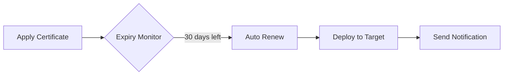
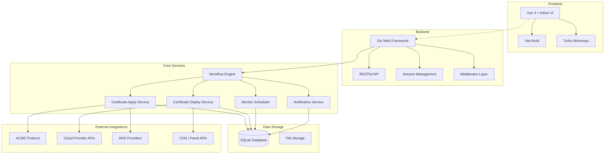

# All in SSL - Complete SSL Certificate Management Tool 🔒

[](https://github.com/allinssl/allinssl?tab=readme-ov-file#AGPL-3.0-1-ov-file)

[](https://github.com/allinssl/allinssl/issues)
[](https://github.com/allinssl/allinssl/releases)
[](https://hub.docker.com/r/allinssl/allinssl)

[中文文档](./README_CN.md)

> 🚀 All-in-one SSL certificate lifecycle management solution | Supports Let's Encrypt, ZeroSSL, Google, SSL.COM, BuyPass and more | Multi-platform deployment | Automated operations

<p align="center">
  
</p>

## 📌 Highlights
- ✅ Fully automated certificate application / renewal
- 🌐 Multi-platform deployment (CDN / WAF / control panels / cloud storage)
- 🔔 Certificate expiration monitoring
- 🛡️ Secure entry protection
- 📊 Visual certificate management

## 🚧 Roadmap

We are actively improving the following features. Feel free to suggest via [GitHub Issues](https://github.com/allinssl/allinssl/issues)!

[](https://github.com/allinssl/allinssl/milestone/1)


## 🚀 Quick Start

### System Requirements
- Linux
- macOS / Windows (script installation not yet supported; see manual steps below)
- Docker

### One-line Install
```bash
curl -sSO http://allinssl.bt.cn/install_allinssl.sh && bash install_allinssl.sh allinssl
```

### One-line Install (Mirror)
```bash
curl -sSO http://download.allinssl.com/install_allinssl.sh && bash install_allinssl.sh allinssl
```

### Docker
```bash
docker run -itd \
  --name allinssl \
  -p 8888:8888 \
  -v /www/allinssl/data:/www/allinssl/data \
  -e ALLINSSL_USER=allinssl \
  -e ALLINSSL_PWD=allinssldocker \
  -e ALLINSSL_URL=allinssl \
  -e TZ=Asia/Shanghai \
  allinssl/allinssl:latest
```

### Binary Installation
1. Open the [releases page](https://github.com/allinssl/allinssl/releases)
2. Download the latest binary for your platform
3. Extract the archive and navigate to the directory in your terminal / CMD
4. Retrieve the login URL, username, and password:
   - URL & username:
     - Linux: `./allinssl 15`
     - Windows: `.\allinssl 15`
   - Password:
     - Linux: `./allinssl 6`
     - Windows: `.\allinssl 6`
5. Start the service (keep the terminal open, or configure a process daemon):
   - Linux: `./allinssl start`
   - Windows: `.\allinssl start`
6. Visit `http://your-server-ip:port/<secure-entry>` and log in
7. See [Command Line Operations](#-command-line-operations) for more commands

### Build from Source
Requires Go 1.23+:
```bash
git clone https://github.com/allinssl/allinssl.git
cd allinssl
go mod tidy
go build -o allinssl cmd/main.go
./allinssl start
```

### First-time Setup
1. Visit `http://your-server-ip:port/<secure-entry>`
2. Add DNS provider and host provider credentials ☁️
3. Create a workflow

[Full Installation Docs](https://allinssl.com/guide/getting-started.html)

## 🎯 Core Features

### 📜 Certificate Management


| Feature          | Supported Providers                                     |
|------------------|---------------------------------------------------------|
| DNS Validation   | Alibaba Cloud, Tencent Cloud, Cloudflare...             |
| Certificate Deploy | BaoTa Panel, 1Panel, Alibaba Cloud CDN, Tencent COS  |
| Monitoring / Alerts | Email, Webhook, DingTalk                            |

### ⚙️ Automation Flow


## 🛠️ Architecture

### 🏗️ System Architecture


## 📚 Documentation
- [Getting Started](https://allinssl.com/guide/getting-started.html)
- [User Manual](https://allinssl.com/features/dashboard.html)

## 💻 Command Line Operations
```bash
# Basic Operations
allinssl 1:  Start service 🚀
allinssl 2:  Stop service ⛔
allinssl 3:  Restart service 🔄
allinssl 4:  Modify secure entry 🔐
allinssl 5:  Modify username 👤
allinssl 6:  Modify password 🔑
allinssl 7:  Modify port 🔧

# Web Service Management
allinssl 8:  Disable web service 🌐➖
allinssl 9:  Enable web service 🌐➕
allinssl 10: Restart web service 🌐🔄

# Background Task Management
allinssl 11: Disable background scheduler 📻⛔
allinssl 12: Enable background scheduler 📻✅
allinssl 13: Restart background scheduler 📻🔄

# System Management
allinssl 14: Disable HTTPS 🔓
allinssl 15: Get panel URL 📋
allinssl 16: Update ALLinSSL to latest version (overwrite install) 🔄⬆️
allinssl 17: Uninstall ALLinSSL 🗑️
```

## 🤝 Contributing
Contributions are welcome in the following ways:
1. Report bugs via Issues
2. Submit Pull Requests 💻
3. Improve documentation 📖
4. Share your use cases ✨

[Contributing Guide](https://allinssl.com/community/contributing.html)

## 📞 Contact
- QQ Group: [768610151](https://qm.qq.com/q/KTmWuskjm0) 👥
- Email: support@allinssl.com 📧
- Bug Reports: [GitHub Issues](https://github.com/allinssl/allinssl/issues)

## 🙏 Acknowledgements

**Open-source projects and communities in the SSL certificate space:**
- [Let's Encrypt](https://letsencrypt.org/) - Free SSL certificate authority
- [lego](https://github.com/go-acme/lego) - Go ACME client powering core certificate issuance
- [acme.sh](https://github.com/acmesh-official/acme.sh) - Pure-shell ACME client
- [certimate](https://github.com/usual2970/certimate) - Workflow design reference; JD Cloud DNS implementation
- [certd](https://github.com/certd/certd) - Workflow design reference
- [Certbot](https://certbot.eff.org/) - EFF's official ACME client
- [Caddy](https://caddyserver.com/) - Automatic HTTPS web server

**Technology stack & dependencies:**

**🔧 Backend**
- **Web Framework**: [gin-gonic/gin](https://github.com/gin-gonic/gin)
- **Database**: [modernc.org/sqlite](https://github.com/modernc/sqlite)
- **ACME Client**: [go-acme/lego](https://github.com/go-acme/lego)
- **Session**: [gin-contrib/sessions](https://github.com/gin-contrib/sessions)
- **HTTP Client**: [go-resty/resty](https://github.com/go-resty/resty)
- **Email**: [jordan-wright/email](https://github.com/jordan-wright/email)
- **Captcha**: [mojocn/base64Captcha](https://github.com/mojocn/base64Captcha)
- **UUID**: [google/uuid](https://github.com/google/uuid)
- **Env Config**: [joho/godotenv](https://github.com/joho/godotenv)

**🎨 Frontend**
- **Framework**: [Vue 3](https://vuejs.org/)
- **UI Components**: [Naive UI](https://naiveui.com/)
- **Build Tool**: [Vite](https://vitejs.dev/)
- **Monorepo**: [Turbo](https://turbo.build/)
- **Router**: [Vue Router](https://router.vuejs.org/)
- **State Management**: [Pinia](https://pinia.vuejs.org/)
- **Utilities**: [VueUse](https://vueuse.org/)
- **Charts**: [ECharts](https://echarts.apache.org/)
- **Workflow Editor**: [Vue Flow](https://vueflow.dev/)
- **HTTP**: [Axios](https://axios-http.com/)
- **CSS**: [TailwindCSS](https://tailwindcss.com/)

**☁️ Cloud Integrations**
- **Alibaba Cloud**: [alibabacloud-go](https://github.com/alibabacloud-go) SDK
- **Tencent Cloud**: [tencentcloud-sdk-go](https://github.com/tencentcloud/tencentcloud-sdk-go)
- **Huawei Cloud**: [huaweicloud-sdk-go-v3](https://github.com/huaweicloud/huaweicloud-sdk-go-v3)
- **Baidu Cloud**: [bce-sdk-go](https://github.com/baidubce/bce-sdk-go)
- **Volcengine**: [volcengine-go-sdk](https://github.com/volcengine/volcengine-go-sdk)
- **JD Cloud**: [jdcloud-sdk-go](https://github.com/jdcloud-api/jdcloud-sdk-go)
- **Qiniu**: [qiniu/go-sdk](https://github.com/qiniu/go-sdk)
- **Azure**: [azure-sdk-for-go](https://github.com/Azure/azure-sdk-for-go)
- **AWS**: [aws-sdk-go-v2](https://github.com/aws/aws-sdk-go-v2)
- **Cloudflare**: [cloudflare-go](https://github.com/cloudflare/cloudflare-go)

**Certificate Authorities:**
- [Let's Encrypt](https://letsencrypt.org/) - Free SSL certificates
- [ZeroSSL](https://zerossl.com/) - Free SSL certificates
- [Google Trust Services](https://pki.goog/)
- [SSL.com](https://www.ssl.com/)
- [BuyPass](https://www.buypass.com/)
- [TrustAsia](https://www.trustasia.com/)
- [Racent](https://www.racent.com/)

**Special thanks to all DNS providers and CDN vendors for their open APIs.**

**Thanks to the following contributors:**
- [@寒雨馨](https://www.hanyuxin.cn/)


## 📜 License
This project is licensed under the [AGPL-3.0 license](./LICENSE).

## 🌟 Star History

[](https://www.star-history.com/#allinssl/allinssl&Date)

---

> 🌟 **Star this project to support development** | Recommended for: small-to-medium site operations, multi-certificate management, and automated HTTPS deployment
