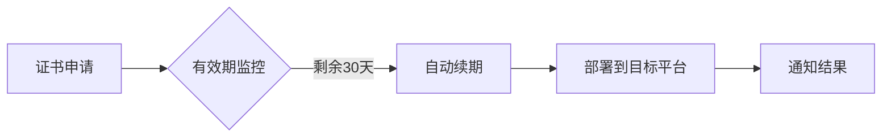

# All in SSL - SSL证书全流程管理工具 🔒

[](https://github.com/allinssl/allinssl?tab=readme-ov-file#AGPL-3.0-1-ov-file)

[](https://github.com/allinssl/allinssl/issues)
[](https://github.com/allinssl/allinssl/releases)
[](https://hub.docker.com/r/allinssl/allinssl)


> 🚀 一站式SSL证书生命周期管理解决方案 | 支持Let's Encrypt Google ZeroSSL SSL.COM | 多平台部署 | 自动化运维

<p align="center">
  
</p>

## 📌 项目亮点
- ✅ 全自动证书申请/续期
- 🌐 多平台部署（CDN/WAF/面板/云存储）
- 🔔 证书过期监控
- 🛡️ 安全入口保护
- 📊 可视化证书管理

## 🚧 开发路线图

我们正在积极完善以下功能，欢迎通过 [GitHub Issues](https://github.com/allinssl/allinssl/issues) 提出建议！

[](https://github.com/allinssl/allinssl/milestone/1)


## 🚀 快速开始

### 系统要求
- Linux 系统
- macOS/Windows（请参照下面教程，暂不支持脚本安装）
- Docker

### 极速安装
```bash
curl -sSO http://download.allinssl.com/install_allinssl.sh && bash install_allinssl.sh allinssl
```

### Docker安装
```bash 
docker run -itd \
  --name allinssl \
  -p 7979:8888 \
  -v /www/allinssl/data:/www/allinssl/data \
  -e ALLINSSL_USER=allinssl \
  -e ALLINSSL_PWD=allinssldocker \
  -e ALLINSSL_URL=allinssl \
  -e TZ=Asia/Shanghai \
  allinssl/allinssl:latest
```

### 编译安装
  - 编译安装时需要注意可执行文件的名称和运行目录，在`allinssl.sh`中需要修改为对应的名称和路径否则可能导致脚本不可用
  - 推荐安装路径为`/www/allinssl/`，可执行文件名为`allinssl`，建议将`allinssl.sh`软链到`/usr/bin/`目录下
  - 安装：
    1. 下载最新版本的release包并解压
    2. 编译go程序（allinssl）
    3. 运行可执行文件启动服务
       - Linux: 执行 `./allinssl start`

### 从 Releases 页面下载构建二进制文件
1. 打开 [releases 下载页面](https://github.com/allinssl/allinssl/releases)
2. 下载最新版本的二进制文件
3. 解压缩文件，并通过终端或者CMD进入解压目录
4. 获取登陆地址，账号和密码
   - 账号和登陆地址：
    - Linux: `./allinssl 15`
    - Windows: `.\allinssl 15`
  - 密码：
    - Linux: `./allinssl 6`
    - Windows: `.\allinssl 6`
5. 运行可执行文件启动服务，请保持终端打开，或者自行配置进程守护
   - Linux: 执行 `./allinssl start`
   - Windows: 终端进入到解压目录，执行 `.\allinssl start`
6. 访问 `http://your-server-ip:port/安全入口`，使用账号和密码登录
7. 更多命令行操作请参考 [命令行操作](#💻-命令行操作)

### 首次配置
1. 访问 `http://your-server-ip:port/安全入口`
2. 添加DNS提供商和主机提供商凭证 ☁️
3. 创建工作流

[完整安装文档](https://allinssl.com/guide/getting-started.html)

## 🎯 核心功能

### 📜 证书管理


| 功能         | 支持提供商                          |
|--------------|-----------------------------------|
| DNS验证      | 阿里云、腾讯云、Cloudflare...      |
| 证书部署     | 宝塔面板、1Panel、阿里云CDN、腾讯云COS |
| 监控通知     | 邮件、Webhook、钉钉                |

### ⚙️ 自动化流程


## 🛠️ 技术架构
- **后端**：Go语言  
- **前端**：HTML/CSS/JavaScript  
- **数据存储**：SQLite  
- **证书管理**：ACME协议 (Let's Encrypt)  
- **定时任务**：内置调度器

## 📚 使用文档
- [快速入门指南](https://allinssl.com/guide/getting-started.html)
- [操作手册](https://allinssl.com/features/dashboard.html)

## 💻 命令行操作
```bash
# 基本操作
allinssl 1: 启动服务 🚀
allinssl 2: 停止服务 ⛔
allinssl 3: 重启服务 🔄
allinssl 4: 修改安全入口 🔐
allinssl 5: 修改用户名 👤
allinssl 6: 修改密码 🔑
allinssl 7: 修改端口 🔧

# Web服务管理
allinssl 8: 关闭web服务 🌐➖
allinssl 9: 开启web服务 🌐➕
allinssl 10: 重启web服务 🌐🔄

# 后台任务管理
allinssl 11: 关闭后台自动调度 📻⛔
allinssl 12: 开启后台自动调度 📻✅
allinssl 13: 重启后台自动调度 📻🔄

# 系统管理
allinssl 14: 关闭https 🔓
allinssl 15: 获取面板地址 📋
allinssl 16: 更新ALLinSSL到最新版本（文件覆盖安装） 🔄⬆️
allinssl 17: 卸载ALLinSSL 🗑️
```

## 🤝 参与贡献
欢迎通过以下方式参与项目：
1. 提交Issue报告问题 🐛
2. 发起Pull Request改进代码 💻
3. 完善项目文档 📖
4. 分享使用案例 ✨

[贡献指南](https://allinssl.com/community/contributing.html)

## 📞 联系我们
- QQ交流群：[768610151](https://qm.qq.com/q/KTmWuskjm0) 👥
- 邮箱：support@allinssl.com 📧
- 问题反馈：[GitHub Issues](https://github.com/allinssl/allinssl/issues)

## 🙏 致谢

**感谢在SSL证书管理领域做出贡献的开源项目和社区：**
- [Let's Encrypt](https://letsencrypt.org/) - 免费SSL证书颁发机构
- [lego](https://github.com/go-acme/lego) - Go语言ACME客户端，为本项目提供核心证书申请功能
- [Certbot](https://certbot.eff.org/) - EFF官方ACME客户端
- [acme.sh](https://github.com/acmesh-official/acme.sh) - 纯Shell脚本实现的ACME客户端
- [Caddy](https://caddyserver.com/) - 自动HTTPS Web服务器
- [certimate](https://github.com/usual2970/certimate) - 工作流部分DNS服务商实现方式参考
- [certd](https://github.com/certd/certd) - 工作流部分的设计参考

**感谢以下技术栈和框架：**

**后端技术栈：**
- [Go](https://golang.org/) - 项目主要开发语言
- [Gin](https://github.com/gin-gonic/gin) - 高性能HTTP Web框架
- [SQLite](https://www.sqlite.org/) & [modernc.org/sqlite](https://github.com/modernc/sqlite) - 轻量级数据库
- [base64Captcha](https://github.com/mojocn/base64Captcha) - 验证码生成
- [UUID](https://github.com/google/uuid) - 唯一标识符生成
- [godotenv](https://github.com/joho/godotenv) - 环境变量管理
- [email](https://github.com/jordan-wright/email) - 邮件发送
- [resty](https://github.com/go-resty/resty) - HTTP客户端

**前端技术栈：**
- [Vue.js 3](https://vuejs.org/) - 渐进式JavaScript框架
- [Naive UI](https://naiveui.com/) - Vue 3组件库
- [Vue Router](https://router.vuejs.org/) - 路由管理
- [Pinia](https://pinia.vuejs.org/) - 状态管理
- [VueUse](https://vueuse.org/) - Vue组合式API工具集
- [ECharts](https://echarts.apache.org/) - 数据可视化图表库
- [Vue Flow](https://vueflow.dev/) - 工作流可视化
- [Axios](https://axios-http.com/) - HTTP客户端
- [Vite](https://vitejs.dev/) - 前端构建工具
- [Turbo](https://turbo.build/) - 单体仓库构建系统

**云服务商SDK：**
- [阿里云](https://www.aliyun.com/) - 阿里云各服务SDK
- [腾讯云](https://cloud.tencent.com/) - 腾讯云SSL和DNSPod SDK
- [华为云](https://www.huaweicloud.com/) - 华为云CDN SDK
- [百度云](https://cloud.baidu.com/) - 百度云BCE SDK
- [火山引擎](https://www.volcengine.com/) - 字节跳动云服务SDK
- [京东云](https://www.jdcloud.com/) - 京东云API SDK
- [七牛云](https://www.qiniu.com/) - 七牛云存储SDK
- [Microsoft Azure](https://azure.microsoft.com/) - Azure DNS SDK
- [Amazon AWS](https://aws.amazon.com/) - AWS Route53 SDK
- [Cloudflare](https://www.cloudflare.com/) - Cloudflare API

**证书颁发机构：**
- [Let's Encrypt](https://letsencrypt.org/) - 免费SSL证书
- [ZeroSSL](https://zerossl.com/) - 免费SSL证书
- [Google Trust Services](https://pki.goog/) - Google证书服务
- [SSL.com](https://www.ssl.com/) - 商业SSL证书
- [BuyPass](https://www.buypass.com/) - 挪威免费SSL证书
- [TrustAsia](https://www.trustasia.com/) - 亚洲诚信
- [Racent](https://www.racent.com/) - 锐成信息

**特别感谢：**
- 所有DNS服务商和CDN提供商对API的开放支持

**感谢以下用户对本项目的支持和贡献：**
- [@寒雨馨](https://www.hanyuxin.cn/)


## 📜 许可证
本项目采用 [AGPL-3.0 license](./LICENSE) 开源协议

## 🌟Star 历史

[](https://www.star-history.com/#allinssl/allinssl&Date)

---

> 🌟 **Star本项目以支持开发** | 推荐用于：中小型网站运维、多证书管理场景、自动化HTTPS部署
